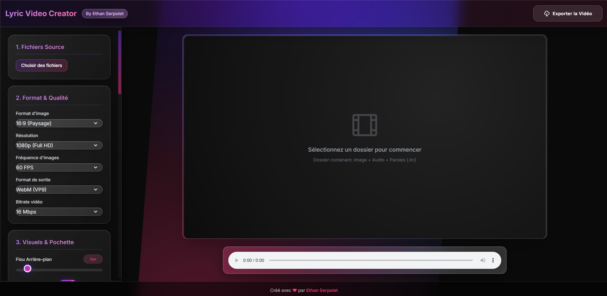

# Lyric Video Creator

[](LICENSE)  
**Lyric Video Creator** est une application web permettant de générer facilement des vidéos de paroles (“lyric videos”) à partir de fichiers image, audio et LRC.

---

## 📝 Description

Ce projet fournit une interface sobre et moderne (avec Tailwind CSS et “effet verre liquide”) pour importer :  
- Une image (ex. pochette d’album)  
- Un fichier audio (MP3, WAV, etc.)  
- Un fichier de paroles au format LRC  

Et pour ensuite configurer votre Lyrics Vidéo a votre image

---

## 🎬 Aperçu



<video controls width="640" loop muted>
  <source src="assets/preview1.mp4" type="video/mp4">
  Votre navigateur ne prend pas en charge la vidéo.
</video>

<video controls width="640" loop muted>
  <source src="assets/preview2.mp4" type="video/mp4">
  Votre navigateur ne prend pas en charge la vidéo.
</video>

---

## ⚙️ Fonctionnalités

- 📁 Import en lot d’image / audio / LRC  
- 🎞️ Aperçu en temps réel  
- 🌈 Contrôles avancés (flou, transitions, particules, synchro rythme…)  
- 🖋️ Police et couleur du texte modifiables  
- 📐 Choix du format, résolution, bitrate et framerate  
- 🚀 Export vidéo incluant la piste audio  

---

## 🚀 Installation

1. **Cloner le dépôt**  
   ```bash
   git clone https://github.com/TON_UTILISATEUR/lyric-video-creator.git
   cd lyric-video-creator
   ```
2. **Ouvrir directement le index.html (aucune dépendance serveur requise)**

---

## 🎛️ Utilisation

1. Cliquez sur **“Choisir des fichiers”** et sélectionnez un dossier contenant :  
   - Une image (`.png`, `.jpg`, `.webp`)  
   - Un audio (`.mp3`, `.wav`, …)  
   - Un fichier de paroles (`.lrc`)  

2. Ajustez les paramètres (format, transitions, effets, etc.)  
3. Appuyez sur **“Exporter la Vidéo”** pour générer et télécharger votre lyric video.  

---

## 🛠️ Développement

- Le projet est en **vanilla JS**, sans build step.  
- Les styles sont gérés par **Tailwind CSS** et un peu de CSS personnalisé.  
- Pour personnaliser Tailwind ou ajouter un workflow de build (PostCSS, Webpack…), il suffit d’ajouter la configuration correspondante.  

---

## 🤝 Contribuer

Les contributions sont les bienvenues !  
1. **Fork** ce dépôt  
2. **Crée** une branche  
   ```bash
   git checkout -b feat/ma-fonctionnalité
   ````
3. **Commit** avec messages clairs
   ```bash
   git commit -m "Ajoute le contrôle XYZ"
   ```
4. Ouvre une Pull Request ici


Merci de respecter ces quelques règles :
Pas de fichiers générés (build, bundles) dans le dépôt
Style de code cohérent (indentation, quotes…)
Mettre à jour / ajouter les tests si nécessaire
Réagir et répondre aux commentaires de la PR
Pour toute question ou suggestion, ouvre une issue ou contacte-moi directement.

---

## 📄 Licence
Ce projet est sous licence MIT – voir le fichier LICENSE pour plus de détails.

Créé avec ❤ par Ethan Serpolet
